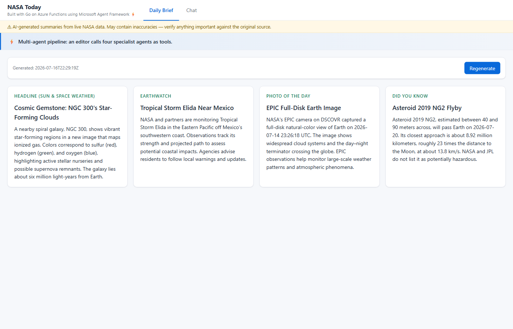
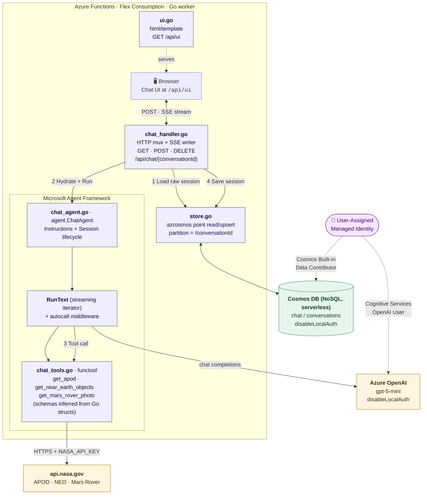
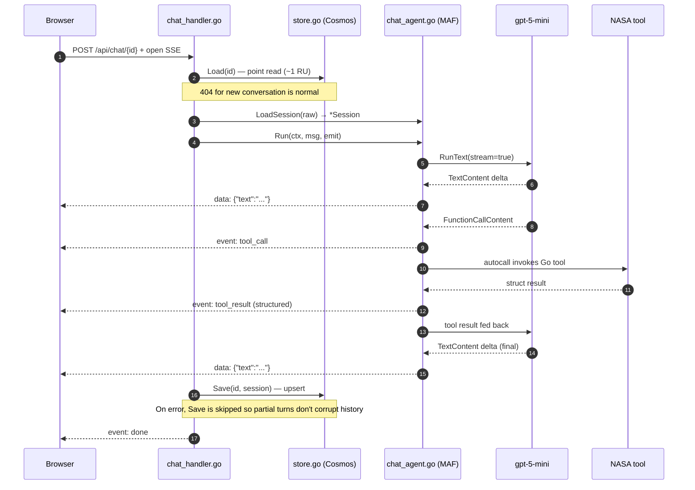

<!--
---
name: Azure Functions Go sample using Microsoft Agent Framework — single-agent chat + multi-agent daily brief with NASA APIs and Cosmos DB
description: Azure Functions quickstart in Go that hosts two Microsoft Agent Framework (MAF) surfaces — a streaming chat agent with three NASA Open API tools (APOD, Near Earth Objects, Mars Rover Photos), and a multi-agent Daily Brief where an editor agent composes a four-card briefing by calling four specialist agents as tools via agenttool.New (adding EONET and EPIC). Sessions persist in Cosmos DB (serverless, AAD-only), the chat streams over SSE, and both surfaces are served from an embedded HTML UI. Deployed to Azure Functions Flex Consumption via the Azure Developer CLI (azd).
page_type: sample
languages:
- azdeveloper
- go
- bicep
products:
- azure
- azure-functions
- azure-openai
- azure-cosmos-db
- entra-id
urlFragment: functions-quickstart-msft-agent-framework-go-azd
---
-->

# NASA Today: Microsoft Agent Framework on Azure Functions (Go)

An end-to-end sample that hosts [Microsoft Agent Framework](https://github.com/microsoft/agent-framework-go) agents inside an Azure Functions app written in Go. It ships as an `azd` template that deploys everything you need — Function App on Flex Consumption, Azure OpenAI, Cosmos DB — with managed identity (no keys in app settings) and disabled local auth on both AOAI and Cosmos.



The sample exposes two MAF-powered surfaces so you can see both single-agent and multi-agent patterns:

1. **Chat** (`/api/ui`, `/api/chat/{id}`) — one MAF `ChatAgent` with three [NASA Open API](https://api.nasa.gov/) tools. The LLM picks a tool per turn, streams results over Server-Sent Events, and the UI renders APOD as an image, NEO as a table, and Mars photos as a gallery.

2. **Daily Brief** (`/api/brief/today`) — a multi-agent editor pipeline. An `Editor` agent composes a four-card briefing by calling four specialist agents *as tools* via `agenttool.New`. Each specialist owns one NASA tool and its own system prompt.

Tools registered in the app:

| Tool | Backing endpoint | Used by |
| --- | --- | --- |
| `get_apod` | Astronomy Picture of the Day | Chat + SpaceHeadlineReporter (briefing) |
| `get_near_earth_objects` | Near Earth Objects browse feed | Chat + AsteroidBriefer (briefing) |
| `get_mars_rover_photo` | Mars Rover imagery | Chat |
| `get_earth_events` | EONET active natural events | EarthWatcher (briefing) |
| `get_earth_photo` | EPIC full-disk Earth photo | PhotoCurator (briefing) |

## Architecture



### Request flow (one user turn)



## Prerequisites

+ [Go 1.25 or later](https://go.dev/dl/) — MAF requires 1.25+.
+ [Azurite](https://learn.microsoft.com/azure/storage/common/storage-use-azurite) for local storage emulation.
+ [Azure Functions Core Tools](https://learn.microsoft.com/azure/azure-functions/functions-run-local?pivots=programming-language-go#install-the-azure-functions-core-tools) 4.12.0 or later.
+ [Azure Developer CLI (`azd`)](https://learn.microsoft.com/azure/developer/azure-developer-cli/install-azd).
+ Azure subscription with quota for `gpt-5-mini` (GlobalStandard) in your chosen region.
+ Optional: a personal [NASA API key](https://api.nasa.gov/) — the default `DEMO_KEY` is heavily rate-limited (~30 requests/hour/IP).

## Initialize the project

```shell
azd init --template Azure-Samples/functions-quickstart-msft-agent-framework-go-azd
```

Or clone directly:

```shell
git clone https://github.com/Azure-Samples/functions-quickstart-msft-agent-framework-go-azd.git
cd functions-quickstart-msft-agent-framework-go-azd
```

## Run locally

With `local.settings.json`'s placeholder endpoints in place, the app boots in **stub mode** (in-memory session store + keyword-triggered fake agent — the APOD stub still calls `api.nasa.gov` so the image renders end-to-end). No Azure resources required.

1. Start Azurite (separate terminal): `azurite`
2. Launch the host: `func start`
3. Open [http://localhost:7071/api/ui](http://localhost:7071/api/ui) and try:
   - `show me today's astronomy picture`
   - `what near-earth asteroids are on approach this week?`
   - `find mars rover photos from sol 1000`

To exercise the real MAF + Azure OpenAI + Cosmos path locally, fill in real endpoints in `local.settings.json` and run `az login` first — `DefaultAzureCredential` will pick up your identity for both AOAI and Cosmos.

## Deploy to Azure

```shell
azd auth login
azd up
```

`azd up` provisions everything defined in `infra/main.bicep` and deploys the Go app. Provisioning includes:

- Resource group + user-assigned managed identity (UAMI) for the app.
- Storage account (blob only, keyless, TLS 1.2), Log Analytics workspace, Application Insights (AAD-only).
- App Service Plan `FC1` (`FlexConsumption`, Linux, reserved), Function App with the Go 1.0 runtime.
- Azure OpenAI account (`S0`, `disableLocalAuth: true`) with one `gpt-5-mini` deployment on `GlobalStandard` SKU (default 30k TPM).
- Cosmos DB NoSQL account (serverless, `disableLocalAuth: true`) with database `chat` and container `conversations` partitioned by `/conversationId`.
- Role assignments to the UAMI (and, for local debugging, your interactive user): `Storage Blob Data Owner`, `Monitoring Metrics Publisher`, `Cognitive Services OpenAI User`, and the Cosmos SQL data-plane role `Built-in Data Contributor` (`00000000-…-002`).

The app receives `AZURE_OPENAI_ENDPOINT`, `AZURE_OPENAI_DEPLOYMENT`, `COSMOS_ENDPOINT`, `COSMOS_DATABASE`, `COSMOS_CONTAINER`, `AZURE_CLIENT_ID`, and `NASA_API_KEY` as app settings. There are no secrets in app settings — AOAI and Cosmos are both reached with the UAMI via `azidentity.NewDefaultAzureCredential`.

Once `azd up` finishes, hit `https://<function-app>.azurewebsites.net/api/ui` to try the deployed agent.

### azd environment knobs

Override these before `azd up` (via `azd env set NAME value`) to tune the deployment:

| Variable | Purpose | Default |
| --- | --- | --- |
| `AZURE_LOCATION` | Deployment region. Pick one that supports both Flex Consumption Go and `gpt-5-mini`. | *prompted* |
| `AZURE_OPENAI_DEPLOYMENT` / `AZURE_OPENAI_MODEL` / `AZURE_OPENAI_MODEL_VERSION` | Swap the chat model. | `gpt-5-mini` / `gpt-5-mini` / `2025-08-07` |
| `AZURE_OPENAI_CAPACITY` | TPM (1000s) for the deployment. | `30` |
| `NASA_API_KEY` | Personal NASA key. Recommended for anything more than a demo. | `DEMO_KEY` |
| `VNET_ENABLED` | Provision the app inside a VNet with private endpoints for storage. | `false` |

## Repository layout

```
.
├── azure.yaml                      # azd service definition (language: go, host: function)
├── main.go                         # Bootstrap: wires runner+sink, registers routes
├── go.mod / go.sum
├── host.json / local.settings.json / .funcignore
├── internal/app/                   # All application code lives here
│   ├── types.go                    # Shared interfaces (ChatRunner, SessionSink, BriefGenerator) + Brief types
│   ├── chat_agent.go               # MAF ChatAgent (Azure OpenAI wiring, LoadSession, Run)
│   ├── chat_tools.go               # Three NASA functools attached to the chat agent
│   ├── chat_handler.go             # Chat HTTP routing + SSE streaming
│   ├── store.go                    # Cosmos-backed session store (azcosmos)
│   ├── briefing_agent.go           # Multi-agent editor + 4 specialists via agenttool.New
│   ├── briefing_tools.go           # 2 extra NASA tools (EONET + EPIC) used by specialists
│   ├── briefing_handler.go         # GET /api/brief/today handler
│   ├── util.go                     # Shared helpers: fetchJSON, requireEnv/envOr, wrapTool
│   ├── stub.go                     # In-memory stubs (used when env vars are empty)
│   ├── ui.go                       # html/template renderer for /api/ui
│   └── ui/index.html               # Chat + Daily Brief page (tool-card rendering)
└── infra/
    ├── main.bicep                  # Subscription-scoped provisioning
    ├── main.parameters.json        # azd-bound parameters
    ├── abbreviations.json          # Resource-name prefixes
    └── app/
        ├── api.bicep               # Flex Consumption Function App (AVM module)
        ├── openai.bicep            # AOAI account + gpt-5-mini deployment
        ├── cosmos.bicep            # Cosmos NoSQL account + chat/conversations
        ├── rbac.bicep              # All role assignments (storage/AI/monitoring/cosmos)
        ├── vnet.bicep              # Optional VNet integration
        └── storage-PrivateEndpoint.bicep
```

## How it works

- **Native Go worker.** The Go worker registers itself with the Functions host at build time via `FUNCTIONS_WORKER_RUNTIME=native`. `host.json` and `.funcignore` are the only pieces of Functions boilerplate; the app is otherwise a plain `net/http` mux.
- **Chat agent wiring.** `internal/app/chat_agent.go` builds the MAF `ChatAgent`; `internal/app/chat_tools.go` registers a `functool` for each NASA endpoint from a Go input struct. MAF derives the JSON schema from that struct so the LLM knows what arguments to send. On each user turn the runner emits either text deltas, `tool_call` frames, or `tool_result` frames (with structured JSON), which the SSE writer forwards to the browser.
- **Multi-agent briefing.** `internal/app/briefing_agent.go` shows the pattern that most naturally justifies MAF: four specialist agents composed into an editor via `agenttool.New`. From the editor's perspective the specialists are just tools with descriptions — the same function-calling machinery, no bespoke orchestration code. Two of the four specialists reuse the chat agent's tools, which demonstrates that a `functool` can be attached to any number of agents.
- **Persistence.** `store.go` uses `github.com/Azure/azure-sdk-for-go/sdk/data/azcosmos` with `azidentity.NewDefaultAzureCredential`. Each conversation is one document, keyed by `conversationId`. The daily brief is *not* persisted — every `/api/brief/today` request re-runs the multi-agent editor so the demo shows the whole pipeline end-to-end.
- **Rendering.** `ui/index.html` inspects each `tool_result` payload and picks a card layout: image + caption for APOD, list of approaches for NEO, thumbnail gallery for Mars. The Daily Brief tab renders four cards, one per specialist section.

## Clean up

```shell
azd down --purge
```

`--purge` immediately removes the soft-deleted AOAI account and Cosmos data so you can redeploy with the same names.

## Resources

- [Azure Functions Go worker](https://github.com/Azure/azure-functions-golang-worker/)
- [Microsoft Agent Framework for Go](https://github.com/microsoft/agent-framework-go)
- [Azure Functions Flex Consumption](https://learn.microsoft.com/azure/azure-functions/flex-consumption-plan)
- [NASA Open APIs](https://api.nasa.gov/)
- [Azure Developer CLI](https://learn.microsoft.com/azure/developer/azure-developer-cli/)
